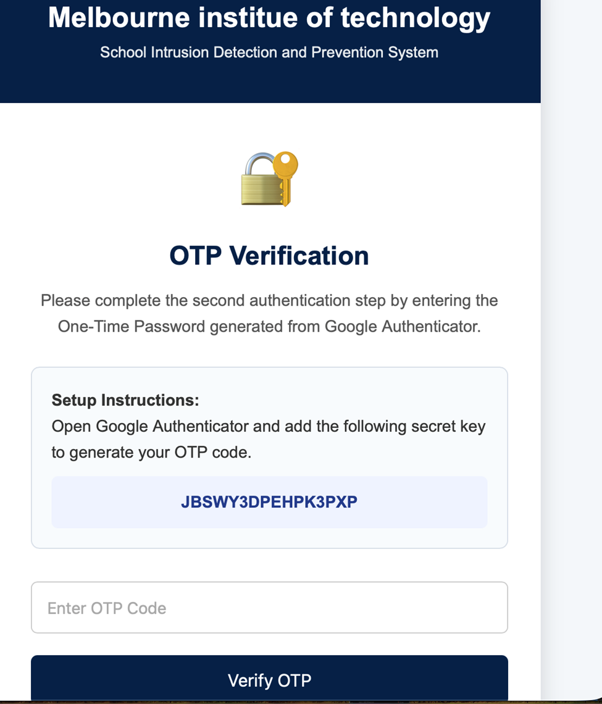
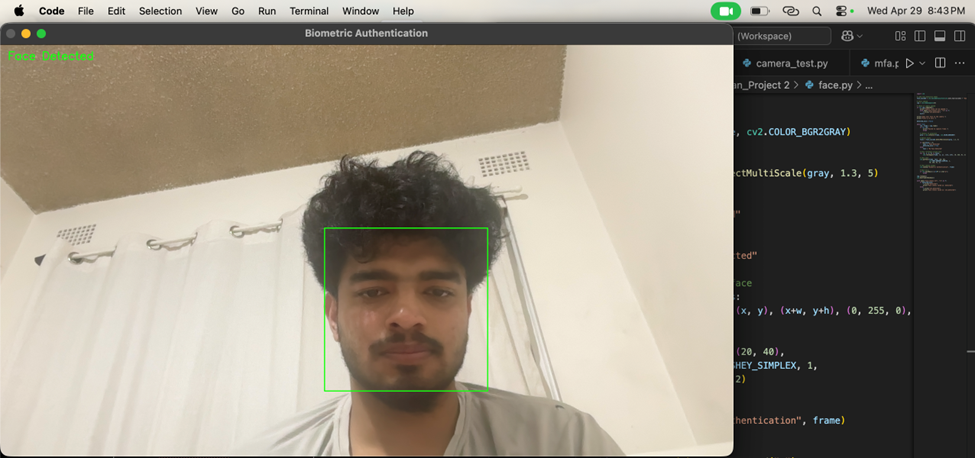

# Biometric Authentication
# BN304 – Project 2: Authentication Module for School SIDPS
Overview
For BN304 Project 2, we implemented the authentication module of the School Network Intrusion Detection and Prevention System (SIDPS). Security features such as Multi‑Factor Authentication (MFA) and biometric verification were essential to prevent unauthorized users from impersonating parents, guardians, or school staff. Strengthening identity verification directly supports SIDPS’s goal of protecting school communication systems from impersonation‑based cyber threats.

Tools and Technologies Used
Tool / Technology	Purpose
Python	Main programming language
Flask	Web application framework
Google Authenticator	OTP‑based MFA
PyOTP	OTP generation and verification
OpenCV	Face detection for biometric verification
HTML/CSS	Web interface design
logs.txt	Stores login and verification logs
face_status.txt	Stores face detection results

System Implementation
The authentication system was developed as a Flask‑based web application with three security layers. Access is granted only after all three steps are successfully completed.

1. Username and Password Login
Running app.py generates a local link such as:

Code
http://127.0.0.1:5001
Users enter their username and password.

Correct credentials: Redirects to the OTP verification page

Incorrect credentials: Displays an error message and logs the failed attempt in logs.txt

This forms the first layer of authentication.

2. OTP Verification (Google Authenticator)
The second layer uses Time‑Based One‑Time Passwords (TOTP) generated through Google Authenticator.

A fixed secret key is stored in the Flask application.

The same key is manually added to the Google Authenticator app.

The system uses PyOTP to generate and verify OTP codes.

If the OTP is:

Correct: User proceeds to face verification

Incorrect: Access is denied and logged

This layer ensures that even if a password is compromised, attackers cannot log in without the OTP.

3. Biometric Face Verification (OpenCV)
The final layer uses OpenCV to detect and verify a user’s face.

Running face.py activates the webcam.

The system checks if a valid face is detected.

The result is written to face_status.txt.

If:

Recognized face: “Face detected – Access granted”

Unrecognized face: “Unrecognized face – Access denied”

The Flask application reads this file and grants access only when a valid face is detected. This demonstrates how biometric authentication can be integrated into SIDPS to reduce impersonation risks.

Logging and Monitoring
A simple logging mechanism was implemented using logs.txt.
The system records:

Successful username/password logins

Failed username/password attempts

Successful OTP verifications

Failed OTP verifications

Successful face detections

Failed face detections

This supports SIDPS monitoring requirements by maintaining a traceable record of authentication activities.

Conclusion
The project successfully demonstrates a multi‑layer authentication system for SIDPS. By combining:

Password verification

OTP‑based MFA

Biometric face detection

…the system significantly reduces unauthorized access risks. This prototype aligns with SIDPS objectives by strengthening identity verification and preventing impersonation‑based cyber threats within school communication systems.