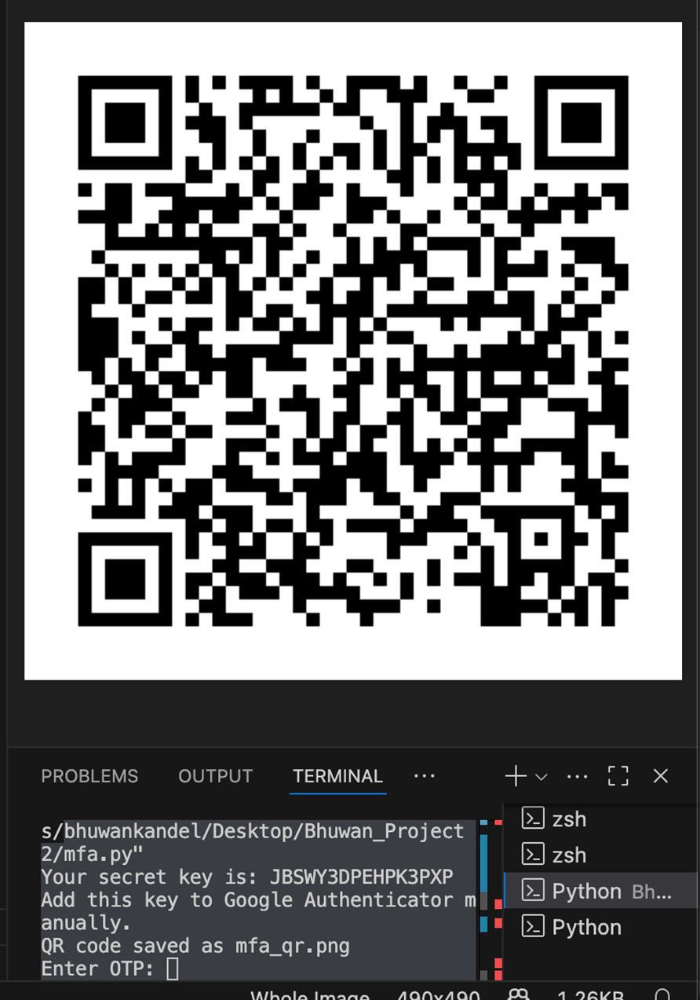

# Multi-Factor Authentication

Google Authenticator was used to implement MFA for secure login verification.

Users must provide:
- Password
- One-Time Password (OTP)

This improves authentication security and reduces unauthorized access attempts.

Our secret key for instance is: JBSWY3DPEHPK3PXP
Add this key to Google Authenticator manually.
QR code saved as mfa_qr.png

