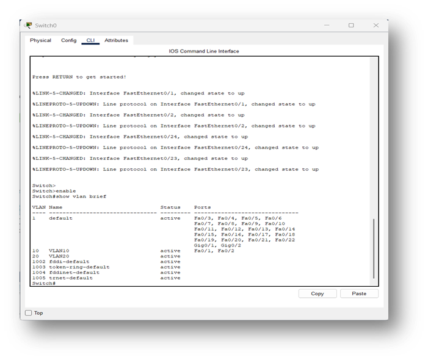
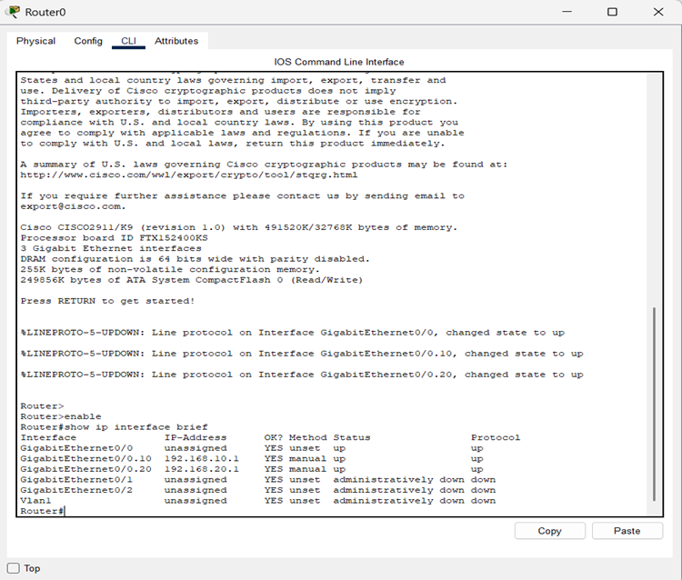
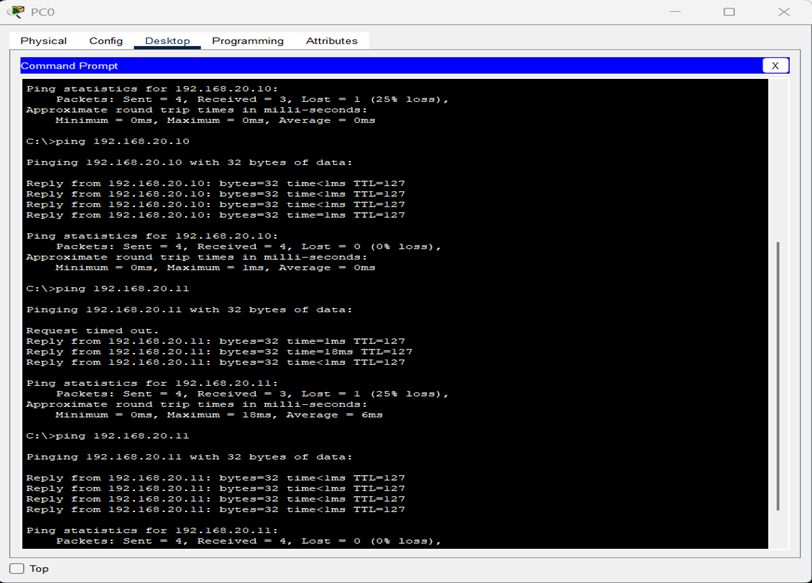
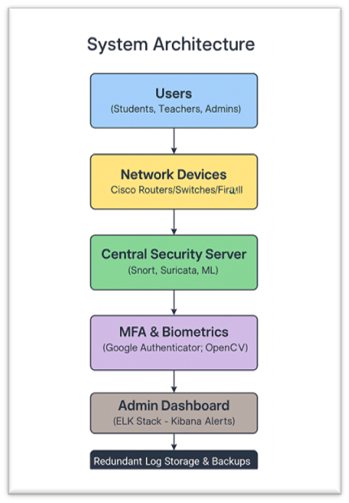

SIDPS-BN304 Network Security and Design

1. Introduction
This project presents the design and deployment of a school network using Cisco Packet Tracer. The network follows a hierarchical architecture consisting of four end‑user PCs, two Layer 2 switches, and one router. The primary objective is to demonstrate secure network segmentation using VLANs and controlled inter‑VLAN communication through a Router‑on‑a‑Stick configuration. This approach reflects real‑world enterprise requirements for security, scalability, and efficient traffic management.

2. Network Design Overview
The network is logically divided into two VLANs to enhance security, performance, and administrative control.

VLAN 10 – Students Network: PC0 and PC1 (via Switch0)

VLAN 20 – Staff Network: PC2 and PC3 (via Switch1)

Design Rationale:  
VLAN segmentation isolates traffic between user groups, ensuring improved security, reduced broadcast traffic, and better manageability. Switches handle Layer 2 forwarding, while the router provides Layer 3 routing between VLANs.

3. VLAN Configuration
Two VLANs were created across the switches to logically separate network traffic:

VLAN 10: Assigned to student devices

VLAN 20: Assigned to staff devices

Each switch port was configured as an access port and assigned to the appropriate VLAN. This separation creates independent broadcast domains, preventing unnecessary traffic flow between groups and improving overall network efficiency.

4. Trunking Configuration
A trunk link was configured between the switches and the router to transport multiple VLANs over a single physical connection. The trunk uses IEEE 802.1Q encapsulation, which tags Ethernet frames with VLAN identifiers.

Purpose of Trunking:

Allows multiple VLANs to share one link

Maintains VLAN separation across devices

Reduces the need for additional physical interfaces

5. Router‑on‑a‑Stick Configuration
Inter‑VLAN routing was implemented using a Router‑on‑a‑Stick setup. The router’s G0/0 interface was divided into sub‑interfaces:

G0/0.10 → VLAN 10 (Students)

G0/0.20 → VLAN 20 (Staff)

Each sub‑interface was configured with an IP address from its respective subnet and 802.1Q encapsulation. This method enables inter‑VLAN communication without requiring multiple physical router ports, making the design cost‑effective and scalable.

6. IP Addressing Scheme
VLAN	Network Address	Subnet Mask	Default Gateway
10	192.168.10.0	255.255.255.0	192.168.10.1
20	192.168.20.0	255.255.255.0	192.168.20.1

Each PC was assigned a static IP address within its VLAN and configured to use the router’s sub‑interface as its default gateway.

7. Network Operation and Traffic Flow
The network operates according to layered communication principles:

Intra‑VLAN Communication:  
Devices within the same VLAN communicate directly through Layer 2 switching.

Inter‑VLAN Communication:  
Traffic between VLAN 10 and VLAN 20 is routed through the router’s sub‑interfaces.

Trunk Transport:  
VLAN‑tagged frames are carried across trunk links using 802.1Q encapsulation.

This structure ensures controlled, secure, and efficient communication across the network.

8. Testing and Verification
The network configuration was validated through several verification steps:

show vlan brief → Confirmed VLAN creation and port assignments

show ip interface brief → Verified router sub‑interface status

Ping tests:

Successful communication within the same VLAN

Successful inter‑VLAN communication via the router

These results confirmed that VLAN segmentation and inter‑VLAN routing were correctly implemented and fully operational.

9. Screenshots Evidence
The following screenshots were captured as proof of configuration and functionality:

<video controls src="Cisco Network Simulation .mp4" title="Cisco Simulation"></video>

# SIDPS System Flow

